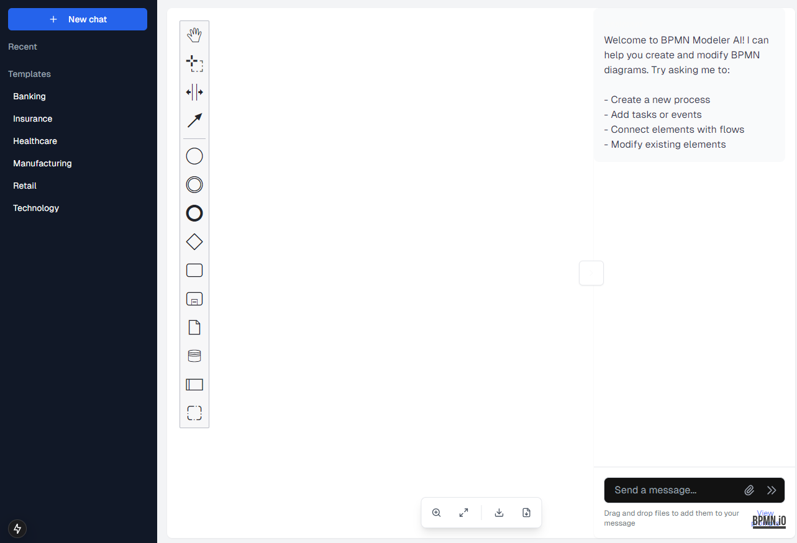

# BPMN Modeler AI (In development)

BPMN Modeler AI is an intelligent business process modeling tool that combines the power of AI with the industry-standard BPMN 2.0 notation. This tool helps business analysts, process designers, and developers create, modify, and manage business process diagrams through natural language interactions.



## Features

### AI-Powered Process Modeling
- Create BPMN diagrams using natural language descriptions
- Modify existing diagrams through conversation
- Get expert guidance on BPMN best practices
- Receive suggestions for process improvements

### Smart Diagram Management
- Each chat automatically creates and maintains its own diagram
- Rename and organize your process diagrams
- Delete chats and associated diagrams together
- Full version history of your process models

### Professional BPMN Editor
- Full BPMN 2.0 compliant modeler
- Interactive diagram editing
- Expand to full-screen mode
- Export diagrams as images or .bpmn files
- Fit-to-view functionality
- Multiple size options (small/medium/large)

### User Interface
- Dark-themed sidebar for easy navigation
- Chat interface for AI interaction
- Real-time diagram updates
- Clean, modern design

## Getting Started

1. **Installation**
   ```bash
   # Clone the repository
   git clone https://github.com/dylantullberg/bpmn-modeler.git
   cd bpmn-modeler-ai

   # Install dependencies
   pnpm install
   ```

2. **Environment Setup**
   ```bash
   # Copy the example environment file
   cp .env.example .env.local

   # Configure your environment variables
   # Required: DATABASE_URL, OPENAI_API_KEY
   ```

3. **Database Setup**
   ```bash
   # Run database migrations
   pnpm db:migrate
   ```

4. **Development**
   ```bash
   # Start the development server
   pnpm dev
   ```

   The application will be available at http://localhost:3000 and will automatically redirect to the dashboard.

5. **Build**
   ```bash
   # Create production build
   pnpm build
   ```

## Usage

1. **Creating a New Process**
   - Click "New chat" in the sidebar
   - Describe your process to the AI
   - The AI will create a BPMN diagram based on your description

2. **Modifying a Process**
   - Open an existing chat from the sidebar
   - Describe the changes you want to make
   - The AI will guide you through making the modifications

3. **Managing Diagrams**
   - Export diagrams using the bottom toolbar
   - Adjust the view using size controls
   - Use "Fit to view" for optimal display
   - Expand to full screen for detailed editing

## Technology Stack

- **Frontend**
  - Next.js 14
  - React
  - Tailwind CSS
  - bpmn-js

- **Backend**
  - Next.js API Routes
  - PostgreSQL with Drizzle ORM
  - OpenAI API

- **Development**
  - TypeScript
  - ESLint
  - Prettier
  - Biome

## Contributing

We welcome contributions! Please see our [Contributing Guidelines](CONTRIBUTING.md) for details on how to submit pull requests, report issues, and contribute to the project.

## License

This project is licensed under the MIT License - see the [LICENSE](LICENSE) file for details.

## Acknowledgments

- Built on top of [bpmn-js](https://github.com/bpmn-io/bpmn-js) by Camunda
- Inspired by the [Vercel AI Chatbot](https://github.com/vercel/ai-chatbot)
- Uses OpenAI's GPT models for natural language processing
